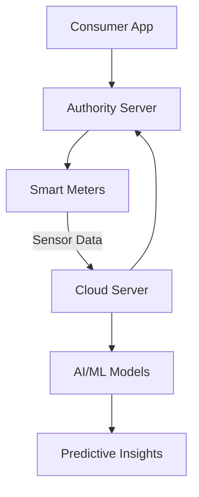
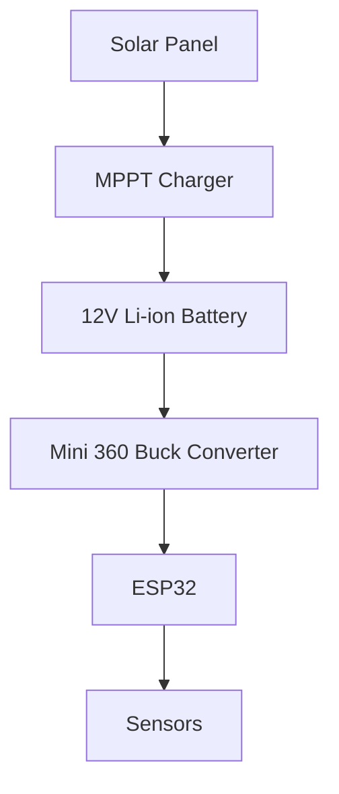

<p align="center">
  
  <h2 align="center"> 🌊 HydroLink Plus – Smart Water Management System  </h2>
</p>

<p align="center">
  
  
  
  
  
  
</p>

> [!WARNING]  
> This project is currently under development. Some features are in progress and may not be fully functional.


**HydroLink Plus** is an IoT and AI-powered solution designed to retrofit traditional water meters into smart systems. By leveraging solar energy, advanced sensors, and AI analytics, HydroLink Plus enables real-time water monitoring, predictive maintenance, and automated billing for consumers and authorities alike.  

---

## 🔗 Documentation Wiki  

Explore the complete **HydroLink Plus Documentation** for detailed insights into setup, usage, and advanced features:  
👉 [**HydroLink Plus Documentation Wiki**](https://github.com/your-repo/HydroLinkPlus/wiki)  

---

## 🚀 Features  

### 🌟 Key Highlights  
- **📡 IoT-Enabled**: Real-time monitoring of water usage and quality.  
- **🔋 Energy-Efficient**: Operates on solar power with dynamic power management.  
- **🧠 AI-Powered**: Predicts maintenance needs using ML algorithms.  
- **📱 User-Friendly Apps**: Authority portal and consumer mobile app for seamless interaction.  
- **📈 Scalable**: Designed for homes, industries, and municipalities.  

---

## 💡 Motivation  

Water is one of the planet's most precious resources, yet inefficiencies in its management lead to significant wastage. HydroLink Plus was conceived to:  
- **🔍 Detect and Prevent Leaks**: Identify anomalies in real-time to prevent wastage.  
- **📊 Empower Consumers**: Provide actionable insights to encourage responsible water usage.  
- **🌍 Conserve Resources**: Enable authorities to optimize distribution and minimize loss.  

---

## 📊 Feasibility  

### Technical Feasibility  
- **Renewable Energy Integration**: Operates independently using solar panels, ensuring uninterrupted service.  
- **IoT Backbone**: Uses robust communication (Wi-Fi/GSM) for data transmission.  
- **AI/ML Capabilities**: Analyzes usage patterns for predictive maintenance and billing automation.  

### Economic Feasibility  
- **Affordable Components**: Designed using cost-effective hardware like ESP32 and open-source software frameworks.  
- **Scalable Design**: Suitable for individual homes, communities, and industrial facilities, ensuring economies of scale.  

---

## 📂 Repository Structure  

```plaintext
HydroLinkPlus/
├── hardware/
│   ├── 3d-case/           # 3D printing files for the hardware casing
│   ├── pcb-design/        # PCB schematics and design files
├── firmware/
│   ├── src/               # ESP-IDF firmware source code
│   ├── ota-updates/       # OTA update logic and scripts
├── software/
│   ├── portal/            # Laravel and Next.js code for the authority portal
│   ├── app/               # React Native consumer app code
├── docs/                  # Documentation files
└── README.md              # Project overview
```

---

## 🛠️ Installation  

### 1. Clone the Repository  
```bash
git clone https://github.com/your-repo/HydroLinkPlus.git
cd HydroLinkPlus
```

### 2. Hardware Setup  
- Refer to the [3D Printing Case Documentation](docs/3d-printing-case.md) for assembling the case.  
- Follow the [PCB Schematics](docs/pcb-schematics.md) for hardware connections.  

### 3. Firmware Installation  
- Navigate to the `firmware/` directory:  
  ```bash
  cd firmware
  idf.py build
  idf.py flash
  ```  
- Refer to the [Firmware Design Documentation](docs/firmware-design.md).  

### 4. Software Deployment  
- Deploy the Laravel-based backend and Next.js portal by following [Authority Portal Documentation](docs/nextjs-laravel-portal.md).  
- Run the React Native app using:  
  ```bash
  npm install
  npm run android  # or npm run ios
  ```

---

## 🖥️ System Architecture  

### Overall System Flow  



### Power Management Architecture  



---

## 🔍 Key Features  

### 1. **Hardware**  
- **3D-Printed Case**: Compact, weatherproof design for outdoor deployment.  
- **Power Management**: Solar-powered with MPPT charging and efficient battery usage.  

### 2. **Firmware**  
- **Deep Sleep Mode**: Optimizes power consumption by minimizing active time.  
- **Over-the-Air Updates**: Enables remote firmware upgrades securely.  

### 3. **Software**  
- **Authority Portal**: Monitor meters, track alerts, and manage billing.  
- **Consumer App**: Real-time water usage and payment interface.  

### 4. **AI/ML Features**  
- **Predictive Maintenance**: Detects anomalies and predicts sensor degradation.  
- **Usage Forecasting**: Estimates future water needs based on historical trends.  

---

## 🤝 Contributors  

### Core Team  
- **Albin K Varghese** – Project Lead  
- **Albin Varghese** – Backend Developer  
- **Amithamol Varghese** – Frontend Developer  
- **Amrutha Pradeep** – AI/ML Specialist  

### Mentor  
- **Ms. Devi T Gopal** – Assistant Professor  

---

## 📚 Resources  

- **Documentation Wiki**: [Complete Project Docs](https://github.com/your-repo/HydroLinkPlus/wiki)  
- **API Reference**: [Explore API Endpoints](docs/api-reference.md)  
- **Database Schema**: [Database Design](docs/database-schema.md)  

---

## 📝 License  

This project is licensed under the MIT License. See the [LICENSE](LICENSE) file for details.  

---

## 🌟 Support  

For questions, issues, or feature requests:  
- **Contact**: support@hydrolinkplus.com  
- **GitHub Issues**: [Submit Here](https://github.com/your-repo/HydroLinkPlus/issues)  

**HydroLink Plus – Smart Water Management, Simplified. 🌍💧**
