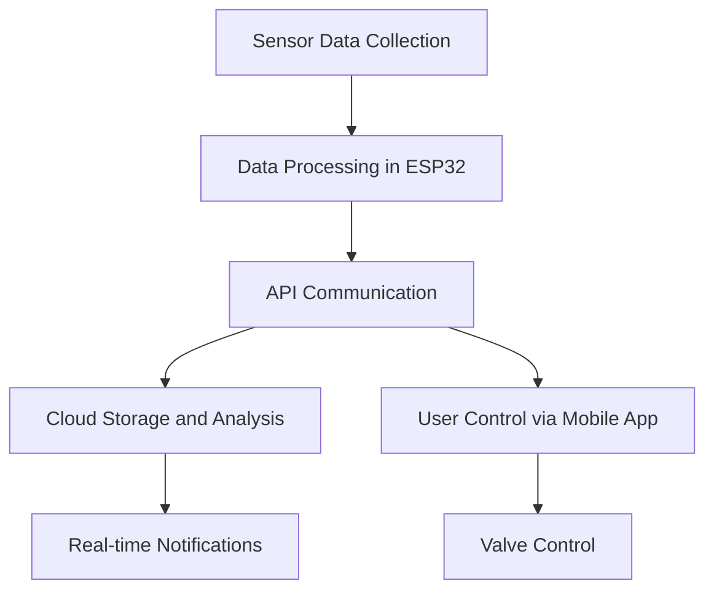
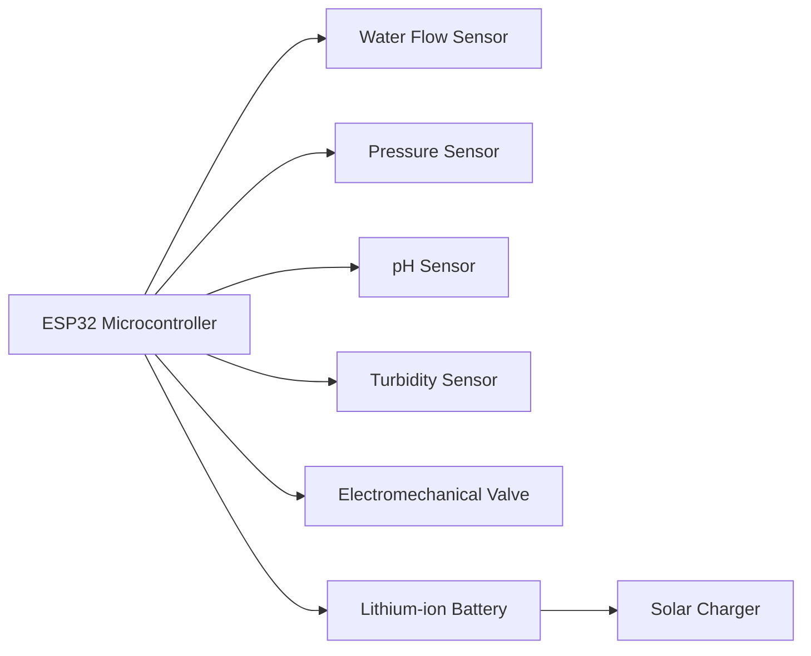

# 🌊 HydroLink Plus Firmware 🌟

## 📖 Overview

HydroLink Plus is a smart water metering solution that integrates IoT and AI technologies to transform traditional water meters into intelligent devices. This firmware powers the ESP32 microcontroller to monitor water usage, quality, and control valves remotely while ensuring secure, efficient operations.

---

## 🏗️ Project Architecture

### Directory Structure

```plaintext
hydrolink-plus-firmware/
├── components/
│   ├── api/                     # API handling logic
│   ├── sensors/                 # Sensor management modules
│   ├── ota/                     # OTA updates
│   ├── memory/                  # Memory management utilities
│   ├── tasks/                   # FreeRTOS task definitions
│   ├── utils/                   # Helper utilities
├── main/
│   ├── app_main.c               # Main application entry point
│   ├── config.h                 # Configuration (Wi-Fi, API, etc.)
├── sdkconfig                    # ESP-IDF configuration file
├── partitions.csv               # Partition table
```

---

## ✨ Features

1. **Real-Time Monitoring**

   - Water flow and pressure sensors for accurate usage tracking.
   - pH, turbidity, and temperature sensors for water quality monitoring.

2. **Valve Control**

   - Remote valve control via API to manage water flow effectively.

3. **Data Communication**

   - RESTful APIs using `esp_http_client`.
   - Secure data transmission with TLS encryption.

4. **OTA Updates**

   - Remote firmware updates via secure over-the-air mechanisms.

5. **Power Optimization**

   - Deep sleep mode for reduced energy consumption.

6. **Cloud Integration**
   - Supports FastAPI backend for real-time data management and analytics.

---

## 🛠️ Firmware Modules

### Sensors Module

Manages the collection of data from flow, pressure, pH, and turbidity sensors.

```c
float read_flow_sensor();
float read_pressure_sensor();
float read_ph_sensor();
float read_turbidity_sensor();
```

### Tasks Module

Handles concurrent operations using FreeRTOS tasks for modular execution.

```c
void flow_monitor_task(void *pvParameters);
void valve_control_task(void *pvParameters);
```

### OTA Module

Provides functions for secure firmware updates.

```c
void perform_ota_update(const char *url);
```

---

## 📊 System Diagram

### Firmware Workflow



### Hardware Components



---

## 📋 Prerequisites

1. **Hardware Requirements**:

   - ESP32 DevKitC or equivalent
   - Water flow, pressure, pH, turbidity sensors
   - Electromechanical valve
   - Solar panel and lithium-ion battery

2. **Software Requirements**:
   - ESP-IDF (latest version)
   - Python 3.x
   - FastAPI backend for cloud integration

---

## 🚀 Getting Started

### Step 1: Clone the Repository

```bash
git clone https://github.com/your-repo/hydrolink-plus-firmware.git
cd hydrolink-plus-firmware
```

### Step 2: Setup Development Environment

- Follow the [ESP-IDF setup guide](https://docs.espressif.com/projects/esp-idf/en/latest/esp32/get-started/index.html).

### Step 3: Configure the Project

- Update `config.h` with your Wi-Fi credentials and API endpoints.

### Step 4: Build and Flash

```bash
idf.py build
idf.py flash
```

### Step 5: Monitor Logs

```bash
idf.py monitor
```

---

## 🌐 API Endpoints

### `/status`

- **Method**: GET
- **Description**: Fetch current sensor data and system status.

### `/control_valve`

- **Method**: POST
- **Payload**:
  ```json
  {
    "action": "open"
  }
  ```
- **Description**: Control the valve (open/close).

### `/update`

- **Method**: POST
- **Payload**:
  ```json
  {
    "url": "https://example.com/firmware.bin"
  }
  ```
- **Description**: Trigger OTA firmware updates.

---

## 📜 License

This project is licensed under the MIT License. See the `LICENSE` file for details.
